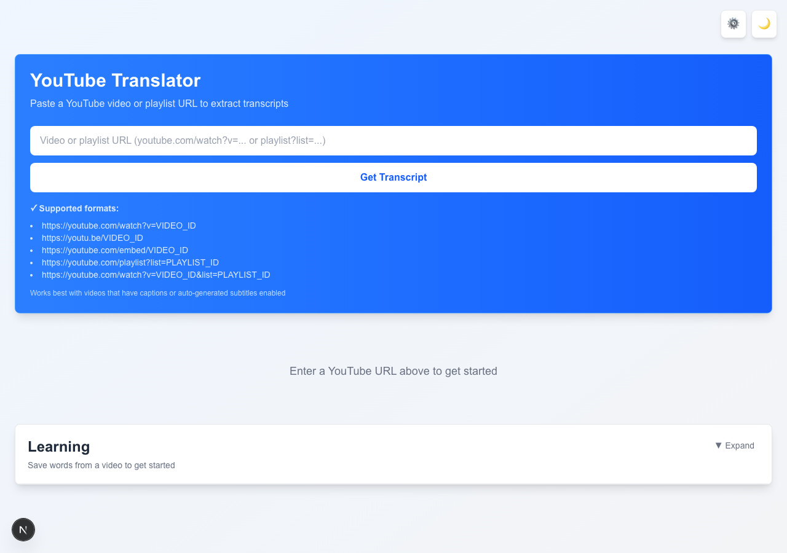

# YouTube Translator

> **Назва продукту:** YouTube Translator · **Коротко:** Translaty

**Платформа для вивчення англійської мови з YouTube-відео** — екстракція субтитрів, AI-аналіз контенту, флешкартки, інтервальне повторення (SRS), квізи, shadowing, вимова та аналітика прогресу.

Додаток працює як **PWA** (Progressive Web App). Дані можуть зберігатися **локально в браузері** (localStorage) або в **backend V2** — SQLite + JWT на машині розробника (без AWS). Після деплою той самий API працює на AWS (Cognito + DynamoDB).

📖 **Посібник для користувачів:** [USER_GUIDE.md](./USER_GUIDE.md) (українською) · [USER_GUIDE.en.md](./USER_GUIDE.en.md) (English) — покроковий опис усіх функцій без технічних деталей.

🇬🇧 **English README:** [README.en.md](./README.en.md)

🗄️ **Локальний backend (без AWS):** [docs/LOCAL_BACKEND.md](./docs/LOCAL_BACKEND.md)

☁️ **Підготовка до AWS:** [docs/INFRASTRUCTURE.md](./docs/INFRASTRUCTURE.md)

---



---

## Цілі проєкту

### Головна мета

Допомогти користувачам **вивчати англійську з реального відеоконтенту** — не просто переглядати субтитри, а перетворювати їх на структурований навчальний матеріал з відстеженням прогресу.

### Ключові цілі

| Ціль | Опис |
|------|------|
| **Екстракція контенту** | Отримання субтитрів з YouTube (ручні та автоматичні), нормалізація, розбиття на речення та фрази |
| **AI-підсилення** | Аналіз транскрипту: фразові дієслова, ідіоми, сленг, граматика, ключова лексика, резюме, тести |
| **Активне навчання** | Флешкартки з контекстом відео, SRS-повторення, квізи, shadowing, перевірка вимови |
| **Персоналізація** | План навчання (Coach), слабкі слова, адаптивні інтервали, цілі за рівнем |
| **Автономність** | Локальне зберігання, офлайн-режим (PWA), імпорт/експорт даних; опційна синхронізація через backend V2 |
| **Багатомовність** | Інтерфейс і переклади: uk, en, pl, es, de, fr |

### Цільова аудиторія

- Україномовні (та інші) вчні англійської, які дивляться YouTube для навчання
- Рівні: beginner → intermediate → advanced (налаштовується в цілях навчання)

---

## Технологічний стек

### Frontend

| Технологія | Версія | Призначення |
|------------|--------|-------------|
| **Next.js** | 16.2.7 | App Router, SSR/CSR, API Routes |
| **React** | 19.2.4 | UI-компоненти |
| **TypeScript** | 5.x | Типізація |
| **Tailwind CSS** | 4.x | Стилізація, dark/light theme |
| **Serwist** | 9.5.11 | PWA, Service Worker, офлайн-кеш |

### Backend (API Routes)

| Технологія | Призначення |
|------------|-------------|
| **Next.js API Routes** | REST-ендпоінти для транскриптів та AI |
| **OpenAI API** (`openai` 6.x) | ChatGPT для аналізу тексту, збагачення карток |
| **yt-dlp** (системна залежність) | Екстракція субтитрів з YouTube |
| **youtube-transcript** / **youtube-transcript-api** | Альтернативні методи отримання субтитрів |
| **yt-dlp-wrap** | Node.js обгортка для yt-dlp |
| **axios** | HTTP-запити |
| **jsdom** + **@mozilla/readability** | Парсинг веб-контенту (де потрібно) |
| **html2pdf.js** | Експорт у PDF |

### Інструменти розробки

| Інструмент | Призначення |
|------------|-------------|
| **ESLint** + `eslint-config-next` | Лінтинг |
| **Playwright** | Responsive E2E тести (`npm run test:responsive`) |
| **sharp** | Генерація PWA-іконок |

### Backend V2 (опційно)

| Технологія | Призначення |
|------------|-------------|
| **SQLite** (`better-sqlite3`) | Локальна БД (`data/local.db`) при `STORAGE_BACKEND=local` |
| **JWT** | Локальна авторизація (`LOCAL_AUTH_SECRET`) |
| **v2-core/** | Спільна бізнес-логіка для Next.js API та AWS Lambda |
| **proxy.ts** | Захист `/api/*` JWT-токеном (крім auth/status/webhook); Next.js 16 `proxy` замість deprecated `middleware` |
| **AWS SAM** (`infra/template.yaml`) | Шаблон для DynamoDB, Cognito, API Gateway, Lambda |

Деталі: [docs/LOCAL_BACKEND.md](./docs/LOCAL_BACKEND.md), [docs/INFRASTRUCTURE.md](./docs/INFRASTRUCTURE.md)

### Зовнішні сервіси

| Сервіс | Використання |
|--------|--------------|
| **YouTube** | Відео, субтитри (через yt-dlp / transcript API) |
| **OpenAI** | AI-аналіз, збагачення карток, пояснення речень |
| **Web Speech API** | Розпізнавання мови для pronunciation checker |

### Зберігання даних

**Режим 1 — лише браузер (класичний PWA):** усі дані в **localStorage** під глобальними ключами (див. таблицю нижче).

**Режим 2 — backend V2** (`NEXT_PUBLIC_BACKEND_V2_ENABLED=true`):

- Ключі користувацьких даних у браузері: **`baseKey::userId`** (наприклад `yoytube-flashcards::abc-123`). Без активного userId використовується `::__anonymous__`.
- На сервері (SQLite `data/local.db`): flashcards, bookmarks, decks, video history, підписки, AI-ліміти.
- Токени: `yoytube-v2-access-token`, `yoytube-v2-refresh-token`, `yoytube-v2-user` (кеш профілю для миттєвого UI).

| Базовий ключ | Дані | Синхронізація V2 |
|--------------|------|------------------|
| `yoytube-flashcards` | Флешкартки | ✅ двостороння (bootstrap + debounced push) |
| `yoytube-decks` | Колоди | ✅ bootstrap merge + create/delete через API |
| `yoytube-bookmarks` | Закладки в транскрипті | ✅ bootstrap + push |
| `yoytube-transcript-history` | Історія відео | ✅ сервер авторитетний при bootstrap |
| `yoytube-transcript-cache-*` | Кеш транскриптів (IndexedDB + prefix) | 🔶 лише локально, per-user prefix |
| `yoytube-quiz-attempts` | Спроби квізів (per-question) | 🔶 лише локально (scoped) |
| `yoytube-quiz-session-results` | Підсумки сесій квізу | ✅ bootstrap + push після сесії |
| `yoytube-pronunciation-attempts` | Спроби вимови / shadowing | ✅ bootstrap + push після спроби |
| `yoytube-daily-study` | Щоденний журнал | ✅ bootstrap + debounced push (сьогодні) |
| `yoytube-playback-position-cache` | Позиція відтворення відео | ✅ bootstrap + push при перегляді |
| `yoytube-learning-goals` | Цілі навчання | ✅ через `/api/v2/settings` (bootstrap + debounced push) |
| `yoytube-learning-settings` | Налаштування навчання (auto-pause) | ✅ через `/api/v2/settings` |
| `yoytube-language-settings` | Мови інтерфейсу / перекладу | ✅ через `/api/v2/settings` |
| AI-кеші (`*-cache-*`) | Результати AI по `videoId` | 🔶 per-user scoped локально, потребують мережі для оновлення |

**Перемикання акаунта:** при вході іншого користувача `clearUserScopedLocalData` очищає scoped-ключі попереднього userId; bootstrap завантажує дані нового акаунта з сервера.

**Офлайн з V2 auth** (див. також §6.3):

| Сценарій | Поведінка |
|----------|-----------|
| Вже увійшли, мережа зникла | Банер «Офлайн» + sync badge; сесія зберігається (мережева помилка ≠ logout) |
| Спроба увійти офлайн | Неможливо без мережі (JWT з сервера) |
| AI / субтитри / sync | Потребують мережі |
| PWA shell | Serwist кешує статику; у dev SW вимкнено |

**Файли:** `app/lib/v2/userStorage.ts`, `app/lib/v2/authBootstrap.ts`, `app/lib/v2/sync*.ts`

---

## Архітектура

```
┌─────────────────────────────────────────────────────────────────┐
│                        Браузер (PWA)                            │
├─────────────────────────────────────────────────────────────────┤
│  AppShell (chrome) + AppProviders (auth, theme, i18n)           │
│  page.tsx                                                       │
│    ├── URLInput / VideoPlayer / TranscriptDisplay               │
│    ├── QuickInfoAnalysis (AI-панелі)                            │
│    ├── ShadowingPanel / PronunciationChecker                    │
│    ├── LearningHubSection                                       │
│    │     ├── Coach (LearningCoachPanel)                         │
│    │     ├── Flashcards (FlashcardsPanel + Study/Quiz)          │
│    │     └── Analytics (LearningAnalyticsPanel)                 │
│    └── AppSettingsPanel (мови, імпорт/експорт, цілі)            │
├─────────────────────────────────────────────────────────────────┤
│  lib/ — бізнес-логіка (flashcards, SRS, quiz, analytics…)     │
│  localStorage + syncFlashcards.ts (V2)                          │
└──────────────────────────┬──────────────────────────────────────┘
                           │ HTTP + JWT (якщо V2 увімкнено)
┌──────────────────────────▼──────────────────────────────────────┐
│  app/api/ — Next.js API Routes                                  │
│    ├── v2/auth/*, v2/flashcards, v2/decks, v2/reviews/today…    │
│    ├── transcript/        — субтитри (yt-dlp)                   │
│    ├── process-text/      — загальний AI-чат                    │
│    ├── enrich-flashcard/  — AI-збагачення карток                │
│    └── find-phrasal-verbs/, generate-quiz/, video-summary/…     │
├─────────────────────────────────────────────────────────────────┤
│  v2-core/ — сервіси, SRS, premium, SQLite/DynamoDB stores      │
│  data/local.db (STORAGE_BACKEND=local)                          │
└──────────────────────────┬──────────────────────────────────────┘
                           │
              ┌────────────┴────────────┐
              │  YouTube  │  OpenAI   │
              └───────────┴───────────┘
```

---

## Модулі та функціональність

### 1. Транскрипції та відео

**Файли:** `app/api/transcript/`, `app/lib/youtubeSubtitles.ts`, `app/lib/normalizeCaptions.ts`, `app/lib/transcriptPipeline.ts`

- Витягування субтитрів з YouTube URL (VTT, SRT, JSON)
- Вибір мови субтитрів (ручні / auto-generated)
- Нормалізація: рядки → речення → фрази (chunks) → абзаци
- Shadowing units: Easy (4–10 слів), Normal (речення), Advanced (абзаци)
- Синхронізація з відеоплеєром (активний рядок, seek по кліку)
- Кеш транскриптів та історія переглядів
- Плейлисти: завантаження серії відео

**Компоненти:** `URLInput`, `VideoPlayer`, `TranscriptDisplay`, `VideoControls`, `PlaylistPanel`, `TranscriptHistorySearch`

---

### 2. AI-аналіз контенту

**Файли:** `app/lib/aiPrompts.ts`, `app/lib/aiChat.ts`, `app/api/*`

| Функція | API | Опис |
|---------|-----|------|
| Фразові дієслова | `/api/find-phrasal-verbs` | Пошук phrasal verbs у транскрипті |
| Ідіоми | `/api/find-idioms` | Ідіоматичні вирази |
| Сленг | `/api/find-slang` | Розмовні вирази |
| Ключова лексика | `/api/find-key-vocabulary` | 15–30 найкорисніших слів |
| Частотні слова | `/api/find-frequent-words` | Топ слів з перекладом |
| Колокації | `/api/find-collocations` | Словосполучення |
| Корисні фрази | `/api/find-useful-phrases` | Готові фрази для вивчення |
| Граматика | `/api/grammar-highlights` | Граматичні конструкції |
| Резюме відео | `/api/video-summary` | Короткий зміст |
| Складність | `/api/video-difficulty` | Оцінка CEFR-рівня відео |
| Глави | `/api/generate-chapters` | Розбиття на розділи |
| Таймлайн | `/api/generate-timeline` | Ключові моменти |
| Нотатки | `/api/generate-notes` | Конспект |
| Квіз по відео | `/api/generate-quiz` | Питання по контенту |
| Переклад рядків | `/api/translate-lines` | Пакетний переклад субтитрів |
| Пояснення речення | `/api/explain-sentence` | AI-пояснення граматики/лексики |
| Довільний чат | `/api/process-text` | TextProcessor — вільні запити |

Результати кешуються в localStorage по `videoId` + мова.

**Компоненти:** `TextProcessor`, `QuickInfoAnalysis`, `VocabularyAnalysis`, `VideoDifficultyPanel`, `VideoChaptersPanel`, `VideoTimelinePanel`, `VideoNotesPanel`, `VideoQuizPanel`, `SentenceExplanation`, `SelectionAnalysis`, `SelectionTranslate`

---

### 3. Флешкартки

**Файли:** `app/lib/flashcards.ts`, `app/lib/decks.ts`, `app/lib/sentenceStore.ts`

#### Модель картки (`Flashcard`)

```ts
{
  id, word, translation, translations?, translationLanguage?,
  example, originalExample?, tags[], videoId?, videoUrl?, videoTitle?,
  deckIds[], sentenceId?, timestamp?,
  explanation?, partOfSpeech?, level?, synonyms?, ipa?, enrichmentStatus?,
  knownCount, unknownCount, quizCorrectCount, quizWrongCount,
  repetitions, ease, interval, nextReview?,
  createdAt, updatedAt?, lastReviewedAt?
}
```

#### Можливості

- Збереження слова з виділення в транскрипті або AI-списків
- Прив'язка до відео, речення, таймкоду
- Колоди (decks) та фільтри: all / due / video / deck
- **Вибір колоди:** назва колоди над списком карток; випадаючий список при джерелі квізу «Колода»
- Bulk save з AI-списків vocabulary
- Редагування, теги, багатомовні переклади
- Дії на картці: слухати, дивитись у відео, повторити, shadowing

**Компоненти:** `SaveFlashcardModal`, `EditFlashcardModal`, `BulkSaveFlashcardModal`, `FlashcardsPanel`, `FlashcardExampleActions`

---

### 4. AI Card Enrichment (TASK-033)

**Файли:** `app/lib/flashcardEnrichment.ts`, `app/api/enrich-flashcard/route.ts`, `app/hooks/useDebouncedCardEnrichment.ts`

Автоматичне збагачення нових карток через OpenAI:

| Поле | Джерело |
|------|---------|
| `translation` | AI (якщо не вказано) |
| `example` | Субтитри (`originalExample`) пріоритетніше за AI |
| `explanation` | AI |
| `partOfSpeech` | AI |
| `level` (CEFR A1–C1) | AI |
| `synonyms`, `ipa` | AI |
| `tags` | AI (phrasal verb тощо) |

- Debounce 800 ms при введенні в модалці
- Bulk enrich до 20 карток
- Налаштування auto-enrich у `LearningSettings`
- Статус: `pending` | `completed` | `failed`

---

### 5. Spaced Repetition (SRS)

#### TASK-027: Basic SRS ✅

**Файл:** `app/lib/flashcardSrs.ts`

| Поле | Опис |
|------|------|
| `repetitions` | Кількість успішних повторень |
| `interval` | Поточний інтервал (дні) |
| `ease` | Коефіцієнт легкості (default 2.5) |
| `nextReview` | Timestamp наступного повторення |

**Стани картки:** `new` → `learning` → `review` → `mastered` (repetitions ≥ 7)

**Due Today:** `nextReview <= now`

**Черга:** сортування за `nextReview`, пріоритет слабких карток

#### TASK-032: Smart Review Engine (Advanced SRS) ✅

Замість простого Know / Don't know — **4-рівнева оцінка** (Anki-подібний SM-2):

| Оцінка | Ефект |
|--------|-------|
| **Again** | repetitions = 0, ease −0.2, повтор через **10 хв** |
| **Hard** | коротший інтервал, ease −0.15 |
| **Good** | стандартний SM-2 крок (1d → 3d → interval × ease) |
| **Easy** | довший інтервал, ease +0.15 |

**Адаптивні модифікатори** (`getReviewModifiers`):

- `unknownCount > knownCount` → interval × 0.7
- Низька точність квізу (`quizWrongCount`) → interval × 0.75
- Низький pronunciation score (< 60%) → interval × 0.8

**Пріоритет черги** (`getWeaknessScore`): слабкі слова, помилки в квізі, погана вимова

**Компонент:** `FlashcardStudyMode` — 4 кнопки Again / Hard / Good / Easy

---

### 6. Квізи по флешкартках

**Файл:** `app/lib/flashcardQuiz.ts`

| Параметр | Варіанти |
|----------|----------|
| Формат | multiple-choice, typing, mixed |
| Тип питання | en→translation MC, translation→en MC, typing EN, typing translation |
| Джерело | due, video, deck, weak, all |

- Джерело **Колода** вимагає вибору колоди (список або розділ «За колодою»)
- Оновлює `quizCorrectCount` / `quizWrongCount` на картці
- Спроби зберігаються в `yoytube-quiz-attempts`
- Впливає на Smart Review (модифікатори інтервалу)

**Компонент:** `FlashcardQuizMode` (показує назву колоди/відео під час тесту)

---

### 6.1. Авторизація та Premium (V2)

**Файли:** `app/components/AppShell.tsx`, `app/components/AppProviders.tsx`, `app/components/auth/`, `proxy.ts`, `v2-core/premium/`

| Функція | Опис |
|---------|------|
| Реєстрація / вхід | Email + пароль, JWT access/refresh tokens |
| Захист UI | `AppShell` → `AppProviders` + auth gate (контент лише для авторизованих, якщо V2 увімкнено) |
| Захист API | `proxy.ts` — Bearer token на `/api/*` (крім auth/status/webhook) |
| Premium | Плани free/premium, ліміти AI (`FREE_AI_DAILY_LIMIT`), Stripe Checkout (опційно) |
| Підписки | `GET /api/v2/subscription`, `POST /api/v2/billing/checkout`, webhook |
| Офлайн-банер | `OfflineStatusBanner` — попередження при `navigator.onLine === false` |
| Sync badge | `SyncStatusBadge` — syncing / saving / offline |

### 6.3. User-scoped storage, sync та офлайн

**Ізоляція даних:** `userScopedStorageKey(baseKey)` → `baseKey::userId`. IndexedDB-кеш транскриптів також має user prefix.

**Bootstrap після входу** (`bootstrapUserData`):

1. `prepareUserSession` — міграція legacy ключів, очистка scoped-даних попереднього userId
2. `bootstrapFlashcardsSync` — merge local ↔ server
3. Паралельно: bookmarks, decks, video history, **user settings**, **quiz session results**, **daily study log**, **pronunciation attempts**, **playback positions**

**Push на сервер:** flashcards (debounced), bookmarks, deck create/delete, **learning settings/goals/languages/theme** (debounced PUT `/settings`), **quiz session summary** (POST `/quiz-results`), **daily study** (PUT `/daily-study-log`), **pronunciation** (POST `/pronunciation-attempts`), **playback position** (PUT `/playback-position`). Per-question quiz attempts, analytics — **ще лише локально**.

**Dev / HMR:** провайдери винесено в `AppProviders.tsx`, щоб зменшити перезавантаження при hot reload. Якщо UI «зависає» на «Завантаження…» або auth не відповідає — **hard refresh** (`Cmd+Shift+R`).

---

### 6.2. SRS API (V2)

**Файли:** `v2-core/srs/`, `v2-core/services/review-service.ts`

- `GET /api/v2/reviews/today` — картки на повторення сьогодні (SM-2, сортування за слабкістю)
- Алгоритм: Easy / Medium / Hard → інтервали та `nextReview`

---

### 7. Shadowing та вимова

**Файли:** `app/lib/shadowingChunks.ts`, `app/lib/pronunciationCompare.ts`, `app/lib/pronunciationAttempts.ts`, `app/lib/speechRecognition.ts`

- **Shadowing:** прослуховування фрази → пауза → повторення користувачем
- Режими: Easy (chunks), Normal (речення), Advanced (абзаци)
- **Pronunciation Checker:** Web Speech API + порівняння з еталоном
- Збереження спроб і best score по фразі
- Інтеграція з SRS (низький score → частіше повторення)

**Компоненти:** `ShadowingPanel`, `PronunciationChecker`

---

### 8. Learning Analytics (TASK-034)

**Файли:** `app/lib/learningAnalytics.ts`, `app/lib/dailyStudyLog.ts`

| Розділ | Метрики |
|--------|---------|
| Overview | картки, mastered, streak, quiz accuracy, SRS success rate |
| Recent activity | reviewed / correct / incorrect сьогодні |
| Weak words | слова з unknownCount > knownCount |
| Hardest words | найбільше помилок |
| Video progress | прогрес по відео (progress bar) |
| Deck progress | прогрес по колодах |
| Phrasal verbs | окремий розділ |
| Achievements | досягнення (streak, mastered тощо) |

**Mastered:** `getCardState(card) === 'mastered'` (repetitions ≥ 7)

**Компонент:** `LearningAnalyticsPanel`

---

### 9. Import / Export (TASK-035)

**Файли:** `app/lib/flashcardImportExport.ts`, `app/lib/flashcardBackup.ts`, `app/lib/csvUtils.ts`

| Формат | Опис |
|--------|------|
| **CSV** | word, translation, example, tags, SRS-поля (опційно) |
| **Anki CSV** | Front, Back, Example, Tags |
| **JSON backup** | cards + decks + dailyStudyLog + quizAttempts |

- Імпорт CSV з маппінгом колонок
- Стратегії дедуплікації: `skip` | `replace` | `merge`
- Повне відновлення з JSON backup

**Компонент:** `ImportExportSettings` (в налаштуваннях)

---

### 10. AI Learning Coach (TASK-036)

**Файли:** `app/lib/learningPlan.ts`, `app/lib/learningGoals.ts`

Rule-based план навчання (без LLM):

| Джерело даних | Що генерується |
|---------------|----------------|
| Due cards | скільки карток повторити сьогодні |
| Weak words | пріоритетні слова |
| Active video | рекомендоване відео для продовження |
| Transcript history | незавершені відео |
| Phrasal verbs | прогрес по фразових дієсловах |
| Quiz / pronunciation today | прогрес денних цілей |

**Цілі за рівнем** (`beginner` / `intermediate` / `advanced`):

| Рівень | Review | New words | Shadowing | Quiz |
|--------|--------|-----------|-----------|------|
| Beginner | 5 | 2 | 2 | 5 |
| Intermediate | 15 | 5 | 3 | 10 |
| Advanced | 30 | 10 | 5 | 15 |

**Компонент:** `LearningCoachPanel` (вкладка Coach у Learning Hub)

**Реалізовано:** LLM-generated advice (`POST /api/coach-advice`, Premium + AI quota)

**Не реалізовано:** автоматична адаптація цілей

---

### 11. Інтернаціоналізація (i18n)

**Файли:** `app/lib/i18n/messages.ts`, `app/components/InterfaceLanguageProvider.tsx`

| Мова | Код | Інтерфейс | Переклади карток |
|------|-----|-----------|------------------|
| Українська | `uk` | ✅ повний | ✅ |
| English | `en` | ✅ повний | ✅ |
| Polski | `pl` | ✅ (fallback → en) | ✅ |
| Español | `es` | ✅ (fallback → en) | ✅ |
| Deutsch | `de` | ✅ (fallback → en) | ✅ |
| Français | `fr` | ✅ (fallback → en) | ✅ |

Три незалежні налаштування мови:
- **Interface language** — UI
- **Translation language** — переклади на картках, субтитри
- **Task language** — мова AI-завдань (тести, пояснення)

---

### 12. PWA та тема

- **Serwist** Service Worker: precache, offline page (`app/~offline/page.tsx`)
- **manifest.ts**: standalone app, іконки 192/512
- **Theme:** CSS `prefers-color-scheme` + `.dark` / `.light`, `ThemeProvider` синхронізує після mount
- **InstallAppButton** — встановлення як додаток

---

## Структура проєкту

```
yoytube-translaty/
├── app/
│   ├── page.tsx                    # Головна сторінка
│   ├── layout.tsx                  # Root layout
│   ├── components/
│   │   ├── AppShell.tsx            # Auth gate, chrome (theme/i18n у AppProviders)
│   │   ├── AppProviders.tsx        # Theme, i18n, AuthProvider (стабільніший HMR)
│   │   ├── OfflineStatusBanner.tsx # Офлайн-попередження для V2
│   │   ├── auth/                   # AuthProvider, AuthPanel, AuthButton
│   │   ├── FlashcardsPanel.tsx
│   │   └── …
│   ├── api/
│   │   ├── v2/                     # Backend V2 (auth, flashcards, decks, …)
│   │   ├── transcript/
│   │   └── …                       # AI та субтитри
│   └── lib/
│       ├── v2/                     # API client, syncFlashcards, authApi
│       └── …
├── v2-core/                        # Спільна логіка (SRS, premium, stores)
├── infra/
│   └── template.yaml               # AWS SAM (DynamoDB, Cognito, Lambda)
├── data/
│   └── local.db                    # SQLite (не в git)
├── proxy.ts                        # JWT для /api/* (Next.js 16)
├── docs/
│   ├── LOCAL_BACKEND.md
│   └── INFRASTRUCTURE.md
└── …
```

---

## Швидкий старт

### 1. Залежності

```bash
npm install
```

### 2. yt-dlp (рекомендовано для повної функціональності)

```bash
# macOS
brew install yt-dlp

# Linux
pip install yt-dlp
# або
sudo curl -L https://github.com/yt-dlp/yt-dlp/releases/latest/download/yt-dlp -o /usr/local/bin/yt-dlp
sudo chmod a+rx /usr/local/bin/yt-dlp
```

> **Serverless-хостинг (Vercel і подібні) без `yt-dlp`:** якщо бінарник недоступний
> (типова ситуація для Vercel — там немає системного Python/yt-dlp), додаток
> автоматично перемикається на JS-фолбек (`youtube-transcript`, прямі запити до
> YouTube). Базове отримання субтитрів продовжує працювати, але з обмеженнями:
> без списку всіх доступних мов, точної тривалості відео та назви каналу з
> метаданих. Наявність `yt-dlp` перевіряється один раз на старті процесу
> (кешується), тож зайвих спроб виклику бінарника на кожен запит не буде.
> Для повної функціональності на власному сервері використовуй
> [`Dockerfile`](./Dockerfile) — там `yt-dlp` встановлено з коробки.

### 3. OpenAI API та Backend V2

Скопіюй `.env.example` → `.env.local` і налаштуй:

```env
OPENAI_API_KEY=sk-...

# Backend V2 (локальний режим)
STORAGE_BACKEND=local
LOCAL_DB_PATH=data/local.db
LOCAL_AUTH_SECRET=change-me-in-production
NEXT_PUBLIC_BACKEND_V2_ENABLED=true
NEXT_PUBLIC_STORAGE_BACKEND=local
```

Після зміни `.env.local` перезапусти `npm run dev`. При увімкненому V2 потрібна **реєстрація / вхід** (кнопка вгорі справа).

### 4. Запуск

```bash
npm run dev
```

Відкрий http://localhost:3000

### 5. Production build

```bash
npm run build
npm start
```

---

## Продакшн-готовність

Перед публічним запуском:

- **`LOCAL_AUTH_SECRET`** — обов'язково зміни на випадкове значення
  (`openssl rand -hex 32`). У режимі `STORAGE_BACKEND=local` сервер
  **відмовиться стартувати** (`NODE_ENV=production`), якщо секрет не
  змінено з дефолтного/прикладового значення — це захист від підробки JWT.
- **Rate limiting** — базовий in-memory rate limiting на `/api/*` вже
  увімкнено через [`proxy.ts`](./proxy.ts) (10 req/хв на auth-роути, 20 req/хв
  на AI/transcript, 100 req/хв на решту, за IP). Це best-effort захист на
  один процес/контейнер; для serverless з кількома інстансами (Vercel)
  розглянь `@upstash/ratelimit` для справжнього розподіленого ліміту.
- **Privacy Policy / Terms of Service** — шаблони лежать у [`app/privacy`](./app/privacy)
  та [`app/terms`](./app/terms). Це **не юридична консультація** — онови
  плейсхолдери (назва компанії, юрисдикція, контакти) і дай перевірити юристу.
- **Error tracking (Sentry, опційно)** — інтеграція вже підключена
  (`instrumentation.ts`, `instrumentation-client.ts`, `sentry.*.config.ts`) і
  повністю неактивна, доки не задано `SENTRY_DSN` / `NEXT_PUBLIC_SENTRY_DSN`.
  Щоб увімкнути: створи проєкт на [sentry.io](https://sentry.io), додай DSN
  у `.env.local`/Vercel env. Для source-map upload під час білду додатково
  задай `SENTRY_ORG`, `SENTRY_PROJECT`, `SENTRY_AUTH_TOKEN`.
- **robots.txt / sitemap.xml** — генеруються автоматично (`app/robots.ts`,
  `app/sitemap.ts`) на основі `NEXT_PUBLIC_APP_URL`. Обов'язково задай цю
  змінну на реальний домен перед деплоєм — інакше в sitemap потрапить
  `localhost`.
- **Email для Cognito** (якщо `STORAGE_BACKEND=dynamodb`) — за замовчуванням
  Cognito надсилає підтвердження/скидання пароля зі свого домену з лімітом
  **~50 листів/добу**. Для реального трафіку підключи Amazon SES
  (verified domain) як email-провайдер User Pool — інакше частина
  користувачів не отримає лист підтвердження. Деталі:
  [AWS Cognito email settings](https://docs.aws.amazon.com/cognito/latest/developerguide/user-pool-email.html).
- **CI** — `.github/workflows/ci.yml` тепер включає `npm run build`
  (окремо від lint/typecheck/e2e), щоб зловити помилки збірки до мержу.

---

## Команди розробки

| Команда | Опис |
|---------|------|
| `npm run dev` | Dev-сервер (webpack) |
| `npm run build` | Production build + PWA icons |
| `npm run start` | Production server |
| `npm run lint` | ESLint |
| `npm run typecheck` | TypeScript (`tsc --noEmit`) |
| `npm run test:responsive` | Playwright responsive tests |
| `npm run test:auth` | Auth API + UI E2E (ізоляція акаунтів, login/logout) |
| `npm run test:auth-isolation` | Лише API-ізоляція (`account-isolation.spec.ts`) |
| `npm run test:auth-ui` | Лише UI auth (`auth-flow`, multi-user, premium, offline) |
| `npm run db:cleanup-test-users` | Видалити тестові акаунти з `local.db` |
| `npm run generate:icons` | Генерація PWA-іконок |
| `npm run backend:build` | Збірка Lambda handler для AWS |
| `npm run infra:validate` | Валідація SAM-шаблону (`infra/template.yaml`) |

---

## Як користуватися

1. **Встав YouTube URL** — підтримуються `watch?v=`, `youtu.be/`, `embed/`
2. **Переглянь транскрипт** — клік по рядку перемотує відео
3. **AI-аналіз** — фразові дієслова, лексика, резюме, тести
4. **Збережи слова** — виділи текст або збережи з AI-списку
5. **Навчання** — Learning Hub:
   - **Coach** — денний план
   - **Flashcards** — повторення (SRS), квізи, колоди з видимою назвою обраної колоди
   - **Analytics** — прогрес і слабкі місця
6. **Shadowing** — повторюй фрази вслід за відео
7. **Налаштування** — мови, цілі, імпорт/експорт

При увімкненому **Backend V2** спочатку увійди або зареєструйся (кнопка вгорі справа).

---

## Roadmap / не реалізовано

| Функція | Статус |
|---------|--------|
| Anki `.apkg` імпорт | ❌ |
| LLM Coach advice (`/api/coach-advice`) | ✅ Premium |
| Автоматична адаптація цілей (TASK-036.5) | ❌ |
| Окремий shadowing score на картці (окрім pronunciation) | ❌ |
| Повний Anki SM-2 learning steps у хвилинах | частково (Again = 10 хв) |
| Серверна синхронізація / акаунти | ✅ частково (V2: flashcards, decks, bookmarks, video history) |
| AWS production deploy | 🚧 шаблон готовий (`infra/template.yaml`), deploy не автоматизовано |
| Google login (local V2) | ❌ (лише AWS Cognito) |
| Детальна статистика сесії (Hard/Good/Easy окремо) | ❌ |

---

## Ліцензія

[MIT](./LICENSE)
